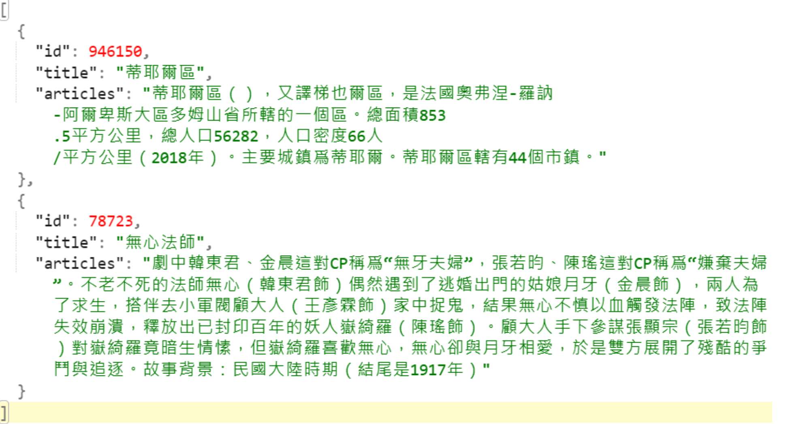

# 維基百科反向索引練習

## 使用套件

+ 斷詞系統: [ckiptagger](https://github.com/ckiplab/ckiptagger) ，由中研院開發，號稱有比「結巴」更高的精準度
+ jieba

## API

### `utils.splitter`

`Class Splitter`:

`def __init__(datapath: str, cuda: bool)`:

+ datapath: model的路徑
+ cuda: 是否使用gpu

`def split(sentences: list, user_dict: dict)`:

+ sentences: 所有需要斷詞的句子的list
+ user_dict: 自訂字典檔，格式如下:

```json
{
    "中文字詞": 1,
    "蔡英九": 5
}
```

+ 其中 1, 5為權重

## 資料格式



## 目標
